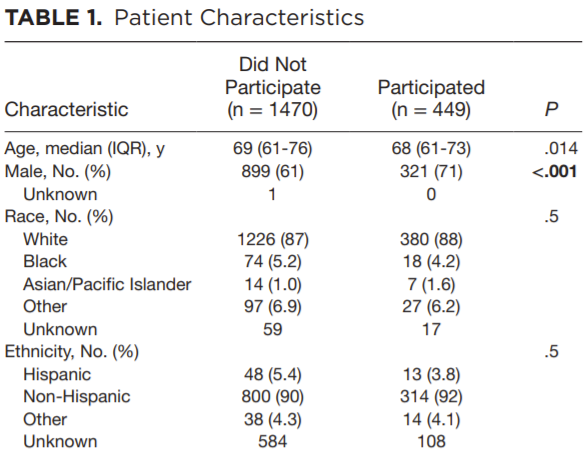

class: inverse, center, middle
# Background and Introduction

---
# The reproducibility crisis

.pull-left[
.large[
- Quality of medical research is often low

- **Low quality code** in medical research part of the problem

- Low quality code is more likely to **contain errors**

- Reproducibility is often **cumbersome** and **time-consuming**
]
]

.pull-right[
<p align="center"></p>
]

.footnote[Image source: https://www.nature.com/news/1-500-scientists-lift-the-lid-on-reproducibility-1.19970; Slide source: http://www.danieldsjoberg.com/rmedicine-gtsummary]


---
# Need reproducible, publication-ready tables

.pull-left[
.large[
How do we get from **code** in R:
```{r eval = FALSE}
summary(df$age)
table(df$sex)
table(df$race)
table(df$ethnicity)
```
]
]

.pull-right[
.large[
To **table** in a publication:
<p align="center">
]
]

.small[
Brierley CK, Zabor EC, Komrokji RS, DeZern AE, Roboz GJ, Brunner AM, Stone RM, Sekeres MA, Steensma DP. Low participation rates and disparities in participation in interventional clinical trials for myelodysplastic syndromes. *Cancer.* 2020 Aug 7. doi: 10.1002/cncr.33105. PMID: 32767690.
]

---
# {gtsummary} overview

.pull-left[
.large[
* Create **tabular summaries** with sensible defaults but highly customizable
* Types of summaries:
  - "Table 1"-types
  - Cross-tabulation
  - Regression models
  - Survival data
  - Survey data
  - Custom tables
]

]

.pull-right[
.large[
* Report statistics from {gtsummary} tables **inline** in R Markdown
* Stack and/or merge any table type
* Use **themes** to standardize across tables
* Choose from different **print engines**
]


]


---
# Example dataset

.pull-left[
.large[
* The `trial` dataset is included with {gtsummary}

* Simulated dataset of baseline characteristics for 200 patients who receive Drug A or Drug B

* Variables were assigned labels using the `labelled` package
]
]

.pull-right[
```{r message = FALSE, warning = FALSE}
library(gtsummary)
library(tidyverse)
head(trial) |> gt::gt()
```
]

---
# Example dataset

.large[
This presentation will use a subset of the variables.
]

```{r}
sm_trial <-
  trial |> 
  select(trt, age, grade, response)
```


```{r echo = FALSE}
tibble(
  Variable = names(sm_trial),
  Label = map_chr(Variable, ~attr(trial[[.x]], "label"))
  ) |> gt::gt()
```


