class: inverse, center, middle
# tbl_summary()


---
# Basic tbl_summary()

.pull-left[

```{r results = FALSE}
sm_trial |>
  select(-trt) |>
  tbl_summary()
```

```{r include=FALSE}
tbl_summary_1 <- 
  sm_trial |>
  select(-trt) |>
  tbl_summary()
my_gtsave("tbl_summary_1")
```

.medium[
- Four types of summaries: `continuous`, `continuous2`, `categorical`, and `dichotomous`

- Statistics are `median (IQR)` for continuous, `n (%)` for categorical/dichotomous

- Variables coded `0/1`, `TRUE/FALSE`, `Yes/No` treated as dichotomous

- Lists `NA` values under "Unknown"

- Label attributes are printed automatically
]

]

.pull-right[
<p align="center">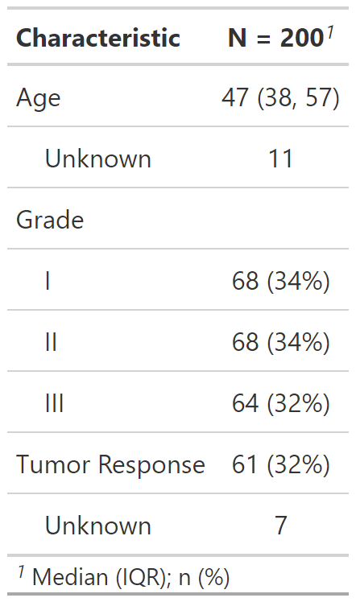</p>
]


---
# Customize tbl_summary() output

.pull-left[

```{r results = FALSE}
sm_trial |>
  tbl_summary(
    by = trt
    )
```

```{r include=FALSE}
tbl_summary_2a <- 
  sm_trial |>
  tbl_summary(
    by = trt
    )
my_gtsave("tbl_summary_2a")
```

- `by`: specifies a column variable for cross-tabulation
]

.pull-right[
<p align="center">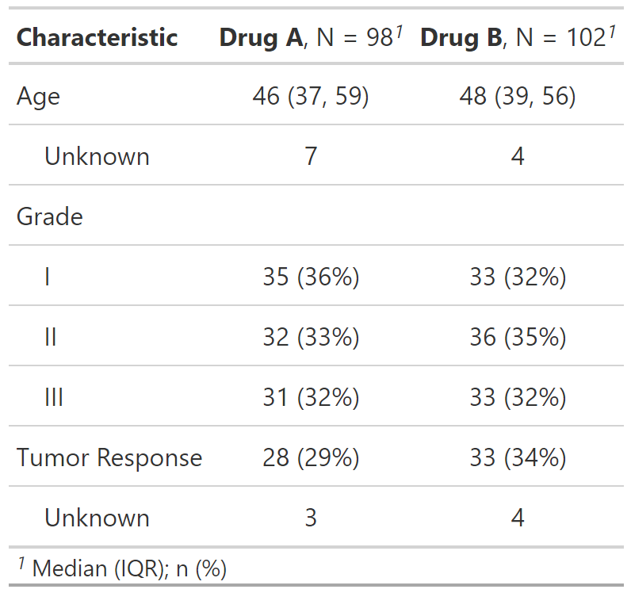</p>
]


---
# Customize tbl_summary() output

.pull-left[

```{r results = FALSE}
sm_trial |>
  tbl_summary(
    by = trt,
    type = age ~ "continuous2"
    )
```

```{r include=FALSE}
tbl_summary_2b <- 
  sm_trial |>
  tbl_summary(
    by = trt,
    type = age ~ "continuous2"
    )
my_gtsave("tbl_summary_2b")
```

- `by`: specify a column variable for cross-tabulation
- `type`: specify the summary type
]

.pull-right[
<p align="center">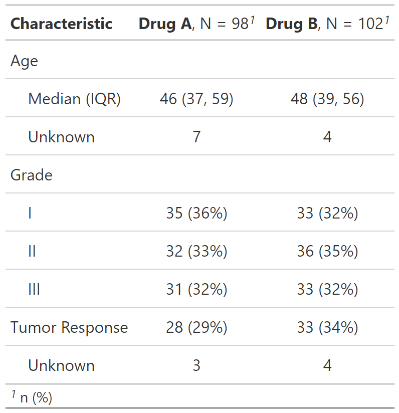</p>
]


---
# Customize tbl_summary() output

.pull-left[

```{r results = FALSE}
sm_trial |>
  tbl_summary(
    by = trt,
    type = age ~ "continuous2",
    statistic = list(
      age ~ c("{mean} ({sd})", 
              "{min}, {max}"), 
      response ~ "{n} / {N} ({p}%)"
    )
    )
```

```{r include = FALSE}
tbl_summary_2c <- 
  sm_trial |>
  tbl_summary(
    by = trt,
    type = age ~ "continuous2",
    statistic = list(
      age ~ c("{mean} ({sd})", 
              "{min}, {max}"), 
      response ~ "{n} / {N} ({p}%)"
    )
    )
my_gtsave("tbl_summary_2c")
```

- `by`: specify a column variable for cross-tabulation
- `type`: specify the summary type
- `statistic`: customize the reported statistics
]

.pull-right[
<p align="center">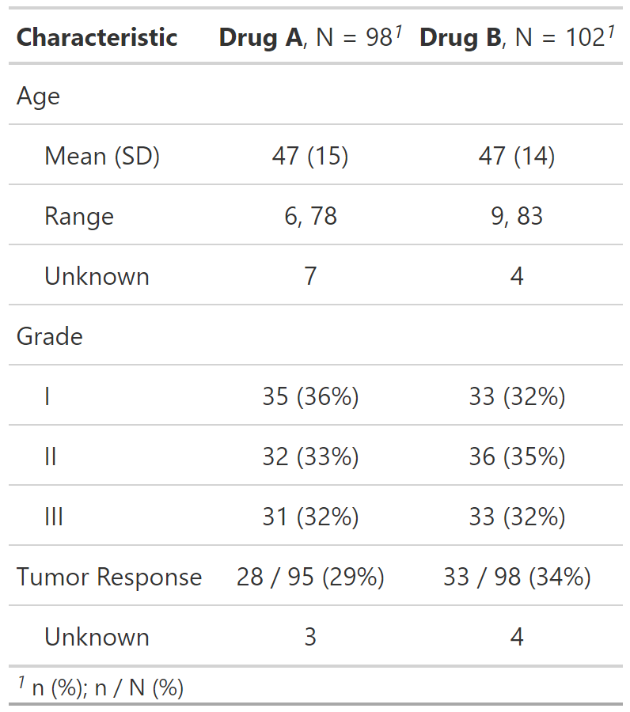</p>
]


---
# Customize tbl_summary() output

.pull-left[

```{r results = FALSE}
sm_trial |>
  tbl_summary(
    by = trt,
    type = age ~ "continuous2",
    statistic = list(
      age ~ c("{mean} ({sd})", 
              "{min}, {max}"), 
      response ~ "{n} / {N} ({p}%)"
    ),
    label = grade ~ "Pathologic grade"
    )
```

```{r include = FALSE}
tbl_summary_2d <- 
  sm_trial |>
  tbl_summary(
    by = trt,
    type = age ~ "continuous2",
    statistic = list(
      age ~ c("{mean} ({sd})", 
              "{min}, {max}"), 
      response ~ "{n} / {N} ({p}%)"
    ),
    label = grade ~ "Pathologic grade"
    )
my_gtsave("tbl_summary_2d")
```

- `by`: specify a column variable for cross-tabulation
- `type`: specify the summary type
- `statistic`: customize the reported statistics
- `label`: change or customize variable labels
]

.pull-right[
<p align="center">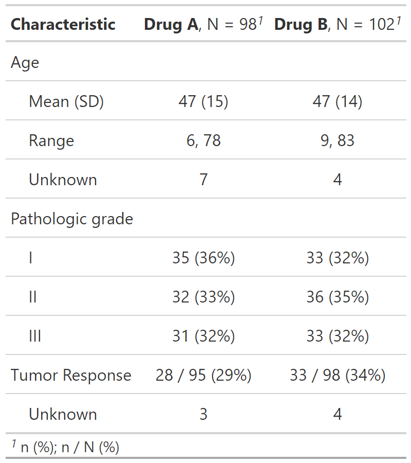</p>
]


---
# Customize tbl_summary() output

.pull-left[

```{r results = FALSE}
sm_trial |>
  tbl_summary(
    by = trt,
    type = age ~ "continuous2",
    statistic = list(
      age ~ c("{mean} ({sd})", 
              "{min}, {max}"), 
      response ~ "{n} / {N} ({p}%)"
    ),
    label = grade ~ "Pathologic grade",
    digits = age ~ 1
    )
```

```{r include = FALSE}
tbl_summary_2e <- 
  sm_trial |>
  tbl_summary(
    by = trt,
    type = age ~ "continuous2",
    statistic = list(
      age ~ c("{mean} ({sd})", 
              "{min}, {max}"), 
      response ~ "{n} / {N} ({p}%)"
    ),
    label = grade ~ "Pathologic grade",
    digits = age ~ 1
    )
my_gtsave("tbl_summary_2e")
```

- `by`: specify a column variable for cross-tabulation
- `type`: specify the summary type
- `statistic`: customize the reported statistics
- `label`: change or customize variable labels
- `digits`: specify the number of decimal places for rounding
]

.pull-right[
<p align="center">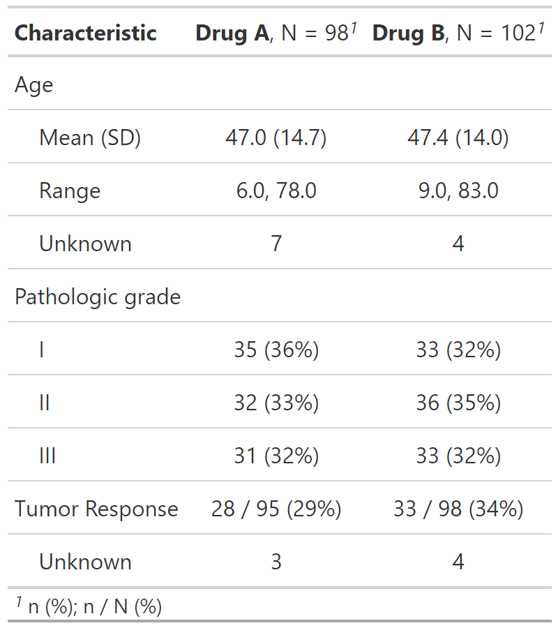</p>
]


---
# Customize tbl_summary() output

.large[**provide argument**       =    **select variables**      ~   **give instructions**]

```{r eval = FALSE}
sm_trial |>
  tbl_summary(
    statistic    =    all_continuous()        ~    "{mean} ({sd})",
    label        =    starts_with("grade")    ~    "Pathologic grade",
    digits       =    age                     ~    2
    )
```

<br>

.large[Use **lists** to pass 2 or more choices:]

```{r eval = FALSE}
label = list(age ~ "Patient age (years)", grade = "Pathologic tumor grade")
```


---
# Add-on functions in {gtsummary}

.xlarge[
`tbl_summary()` objects can also be updated using related functions.

- `add_*()` add **additional column** of statistics or information, e.g. p-values, q-values, overall statistics, N obs., and more

- `modify_*()` **modify** table headers, spanning headers, and footnotes

- `bold_*()/italicize_*()` **style** labels, variable levels, significant p-values

]


---
# Update tbl\_summary() with add\_\*()

.pull-left[
```{r results = FALSE, message = FALSE}
sm_trial |>
  tbl_summary(
    by = trt
    ) |>
  add_p() |>
  add_q(method = "fdr")  
```

```{r include = FALSE}
tbl_summary_3a <-
  sm_trial |>
  tbl_summary(
    by = trt
    ) |>
  add_p() |>
  add_q(method = "fdr")  
my_gtsave("tbl_summary_3a")
```

.medium[
* `add_p()`: adds a column of p-values
* `add_q()`: adds a column of p-values adjusted for multiple comparisons through a call to `p.adjust()`
]
]

.pull-right[
<p align="center">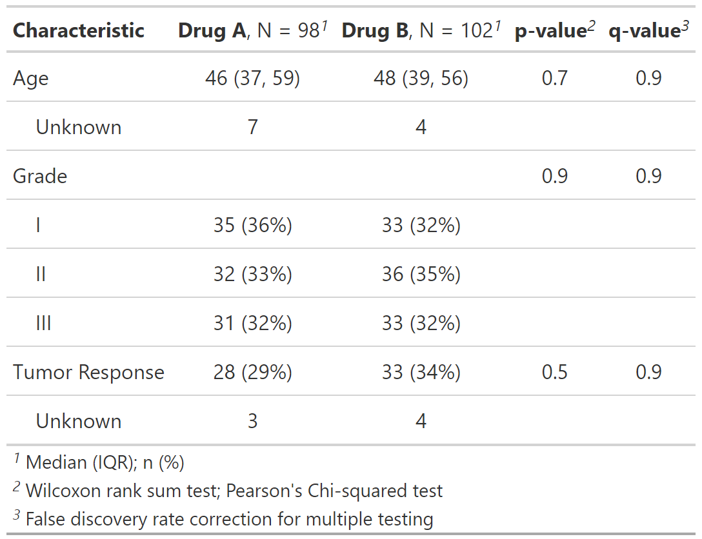</p>
]


---
# Update tbl\_summary() with add\_\*()

.pull-left[
```{r results = FALSE}
sm_trial |>
  tbl_summary(
    by = trt,
    missing = "no"
    ) |>
  add_overall()
```

```{r include = FALSE}
tbl_summary_4a <-
  sm_trial |>
  tbl_summary(
    by = trt,
    missing = "no"
    ) |>
  add_overall()
my_gtsave("tbl_summary_4a")
```

.medium[
* `add_overall()`: adds a column of overall statistics
]
]

.pull-right[
<p align="center">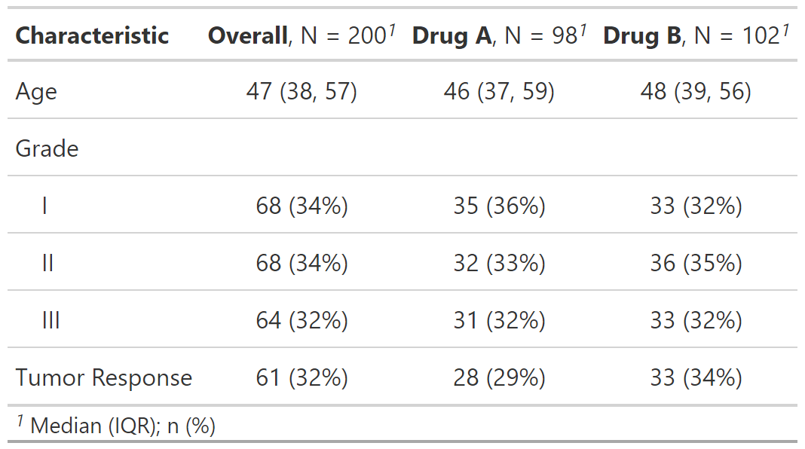</p>
]

---
# Update tbl\_summary() with add\_\*()

.pull-left[
```{r results = FALSE}
sm_trial |>
  tbl_summary(
    by = trt,
    missing = "no"
    ) |>
  add_overall() |> 
  add_n() 
```

```{r include = FALSE}
tbl_summary_4b <-
  sm_trial |>
  tbl_summary(
    by = trt,
    missing = "no"
    ) |>
  add_overall() |> 
  add_n() 
my_gtsave("tbl_summary_4b")
```

.medium[
* `add_overall()`: adds a column of overall statistics
* `add_n()`: adds a column with the sample size 
]
]

.pull-right[
<p align="center">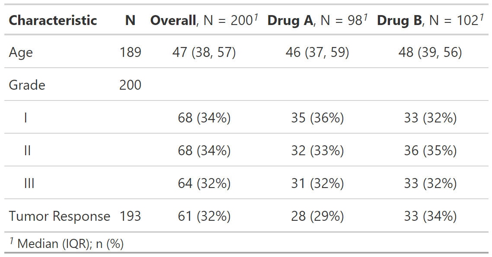</p>
]

---
# Update tbl\_summary() with add\_\*()

.pull-left[
```{r results = FALSE}
sm_trial |>
  tbl_summary(
    by = trt,
    missing = "no"
    ) |>
  add_overall() |> 
  add_n() |>
  add_stat_label(
    label = all_categorical() ~ "No. (%)"
  ) 
```

```{r include = FALSE}
tbl_summary_4c <-
sm_trial |>
  tbl_summary(
    by = trt,
    missing = "no"
    ) |>
  add_overall() |> 
  add_n() |>
  add_stat_label(
    label = all_categorical() ~ "No. (%)"
  ) 
my_gtsave("tbl_summary_4c")
```

.medium[
* `add_overall()`: adds a column of overall statistics
* `add_n()`: adds a column with the sample size 
* `add_stat_label()`: adds a description of the reported statistic
]
]

.pull-right[
<p align="center">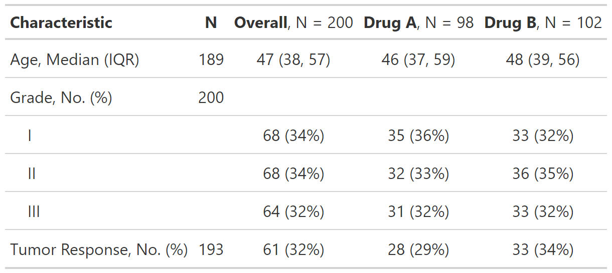</p>
]


---
# Update tbl\_summary() with add\_\*()

```{r results = FALSE}
trial |>
  select(trt, marker, response) |>
  tbl_summary(
    by = trt,
    statistic = list(marker ~ "{mean} ({sd})",
                     response ~ "{p}%"),
    missing = "no"
  ) |>
  add_difference()
```

```{r include = FALSE}
tbl_summary_4d <-
  trial |>
  select(trt, marker, response) |>
  tbl_summary(
    by = trt,
    statistic = list(marker ~ "{mean} ({sd})",
                     response ~ "{p}%"),
    missing = "no"
  ) |>
  add_difference()
my_gtsave("tbl_summary_4d")
```

<p align="center">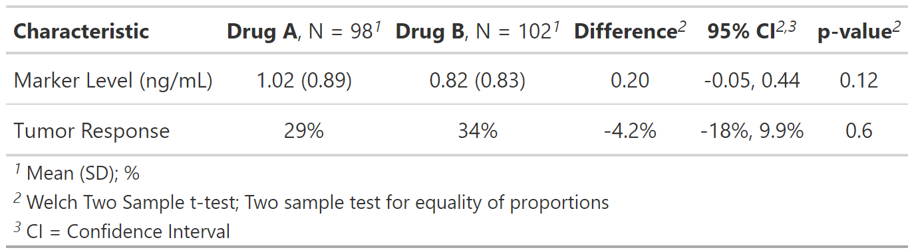</p>

.large[
- `add_difference()`: adds mean and rate differences between groups. Can optionally be adjusted differences, see argument `adj.vars`
]


---
# Update tbl\_summary() with add\_\*()

```{r eval = FALSE}
sm_trial |>
  tbl_summary(
    by = trt,
    missing = "no"
  ) |>
  add_stat(...)
```

.large[
- Write custom statistic functions, and add to table with `add_stat()`
- Added statistics can be placed on the label or the level rows
]


---
# Update tbl\_summary() with bold\_\*()/italicize\_\*()

.pull-left[
```{r results = FALSE}
sm_trial |>
  tbl_summary(
    by = trt
    ) |>
  add_p() |> 
  bold_labels() |>
  italicize_levels() |> 
  bold_p(t = 0.8)
```

```{r include = FALSE}
tbl_summary_3b <-
  sm_trial |>
  tbl_summary(
    by = trt
    ) |>
  add_p() |> 
  bold_labels() |>
  italicize_levels() |> 
  bold_p(t = 0.8)
my_gtsave("tbl_summary_3b")
```

.medium[
* `bold_labels()`: bold the variable labels
* `italicize_levels()`: italicize the variable levels
* `bold_p()`: bold p-values according a specified threshold
]
]

.pull-right[
<p align="center">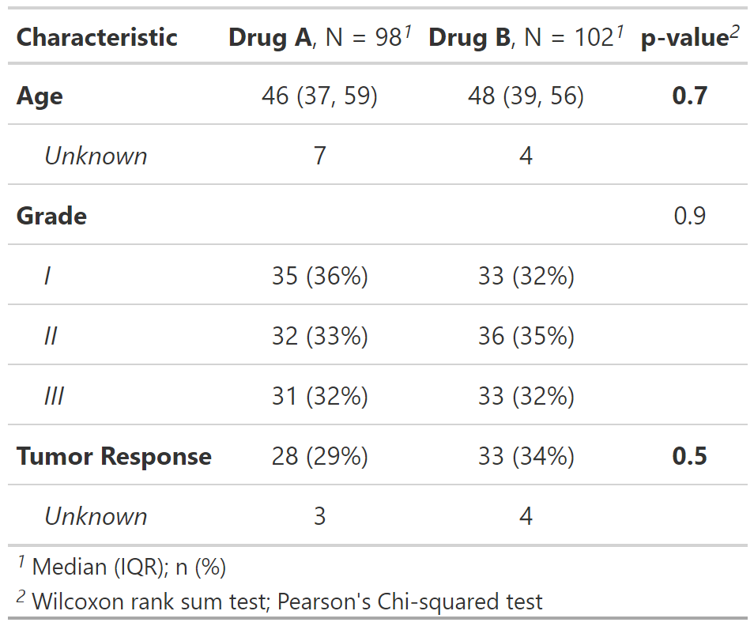</p>
]


---
# Update tbl\_summary() with modify\_\*()

.pull-left[
.tiny[
```{r results = FALSE}
sm_trial |> select(age, response, trt) |> 
  tbl_summary(
    by = trt
    ) |>
  modify_header(
    update = list(
      stat_1 ~ "**A**",
      stat_2 ~ "**B**"
    )) |> 
  modify_spanning_header(
    all_stat_cols() ~ "**Drug**") |> 
  modify_footnote(
   all_stat_cols() ~ 
      "median (IQR) for continuous; 
   n (%) for categorical"
  )
```
]

```{r include = FALSE}
tbl_summary_5 <- 
sm_trial |> select(age, response, trt) |> 
  tbl_summary(
    by = trt
    ) |>
  modify_header(
    update = list(
      stat_1 ~ "**A**",
      stat_2 ~ "**B**"
    )) |> 
  modify_spanning_header(
    update = starts_with("stat_") ~ "Drug") |> 
  modify_footnote(
    update = starts_with("stat_") ~ 
      "median (IQR) for continuous; n (%) for categorical"
  )
my_gtsave("tbl_summary_5")
```
]

.pull-right[
<p align="center">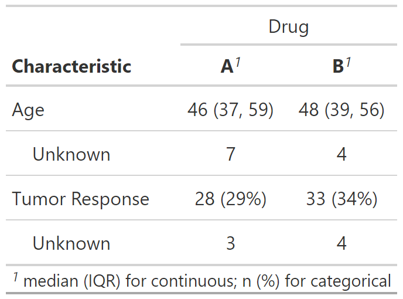</p>
]


---
# Column names

* Use `show_header_names()` to see the internal header names available for use in `modify_header()`
* `all_stat_cols()` selects, for example, columns "stat_1" and "stat_2"

.small[
```{r}
tbl <- sm_trial |> tbl_summary( by = trt) 
show_header_names(tbl)
```
]


---
# Add-on functions in {gtsummary}

.xlarge[
And many more! 

See the documentation at http://www.danieldsjoberg.com/gtsummary/reference/index.html

And a detailed `tbl_summary()` vignette at http://www.danieldsjoberg.com/gtsummary/articles/tbl_summary.html
]


---
# Cross-tabulation with tbl_cross()

.large[`tbl_cross()` is a wrapper for `tbl_summary()` for **n x m** tables]

.pull-left[
<br>
```{r results = FALSE}
sm_trial |>
  tbl_cross(
    row = trt, 
    col = grade,
    percent = "row",
    margin = "row"
  ) |>
  add_p(source_note = TRUE)
```

```{r include=FALSE}
tbl_cross_1 <-
  sm_trial %>%
  tbl_cross(
    row = trt, 
    col = grade,
    percent = "row",
    margin = "row"
  ) %>%
  add_p(source_note = TRUE)
my_gtsave("tbl_cross_1")
```
]

.pull-right[
<p align="center">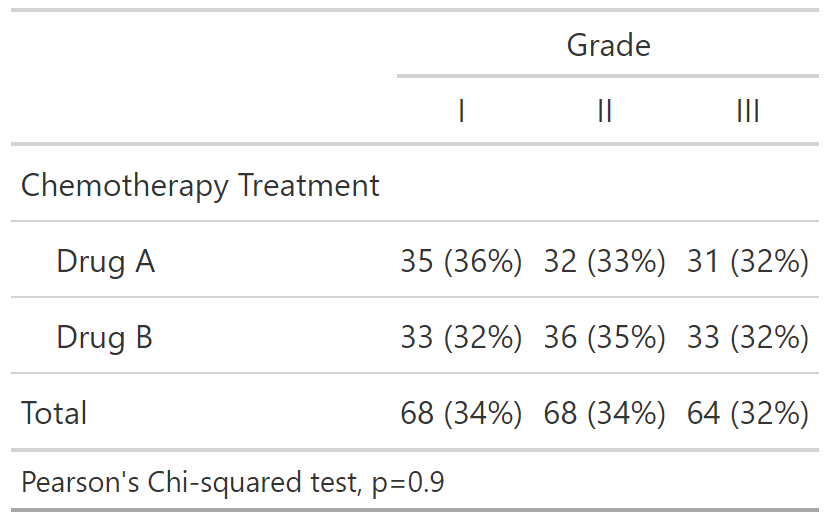</p>
]


---
# Continuous summaries with tbl_continuous()

.large[`tbl_continuous()` summarizes a continuous variable by 1, 2, or more categorical variables]

.pull-left[
```{r results = FALSE}
sm_trial |>
  tbl_continuous(
    variable = age,
    by = trt,
    include = grade
  )
```

```{r include = FALSE}
tbl_cont_1 <-
  sm_trial |>
  tbl_continuous(
    variable = age,
    by = trt,
    include = grade
  )
my_gtsave("tbl_cont_1")
```
]

.pull-right[
<p align="center">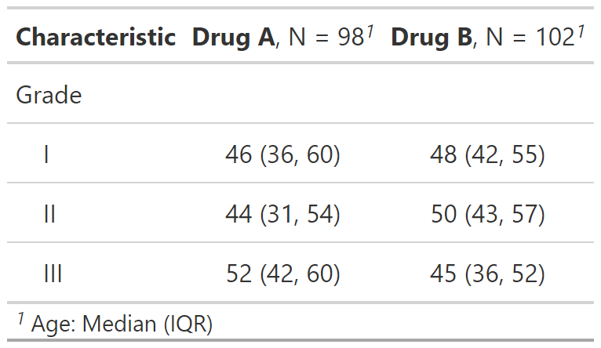</p>
]


---
# Survey data with tbl_svysummary()

.pull-left[
```{r results = FALSE}
survey::svydesign(
  ids = ~1,
  data = as.data.frame(Titanic),
  weights = ~Freq
) |>
  tbl_svysummary(
    by = Survived,
    include = c(Class, Sex)
  ) |>
  add_p() |>
  modify_spanning_header(
    all_stat_cols() ~ "**Survived**"
  )
```

```{r include = FALSE}
tbl_svy_1 <-
  survey::svydesign(
    ids = ~1,
    data = as.data.frame(Titanic),
    weights = ~Freq
) |>
    tbl_svysummary(
        by = Survived,
        include = c(Class, Sex)
    ) |>
    add_p() |>
    modify_spanning_header(
        all_stat_cols() ~ "**Survived**"
    )
my_gtsave("tbl_svy_1")
```
]

.pull-right[
<p align="center">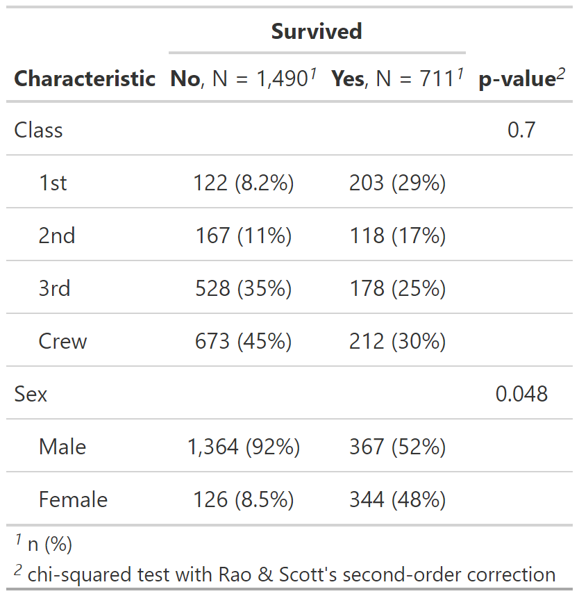</p>
]


---
# Survival outcomes with tbl_survfit()

```{r results = FALSE, warning = FALSE}
library(survival)
fit <- survfit(Surv(ttdeath, death) ~ trt, trial)
tbl_survfit(
  fit, 
  times = c(12, 24),
  label_header = "**{time} Month**"
) |>
  add_p()
```

```{r include = FALSE}
tbl_surv_1 <-
  tbl_survfit(
  fit, 
  times = c(12, 24),
  label_header = "**{time} Month**"
) |>
  add_p()
my_gtsave("tbl_surv_1")
```

<p align="center">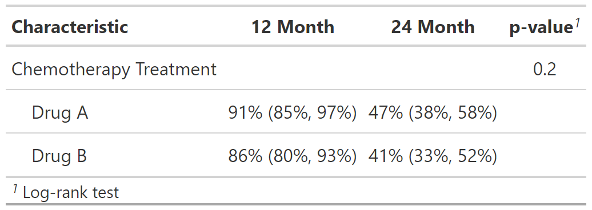</p>


