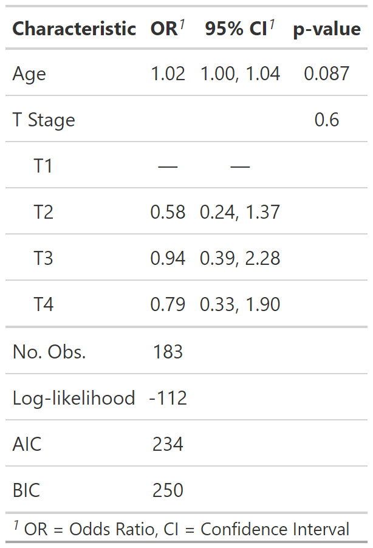

class: inverse, center, middle
# tbl_regression()

---
# Traditional model summary()

.pull-left[
```{r results = FALSE}
m1 <- glm(
  response ~ age + stage,
  data = trial,
  family = binomial(link = "logit")
  )
summary(m1)
```

.medium[
Looks **messy** and it's not easy for others to understand.
]
]

.pull-right[
<p align="center"></p>
]


---
# Basic tbl_regression()

.pull-left[
```{r results = FALSE}
tbl_regression(m1)
```

```{r include = FALSE}
m1_tbl_1 <-
  tbl_regression(
    m1
  )
my_gtsave("m1_tbl_1")
```

.medium[
- Displays **p-values** for covariates

- Shows **reference levels** for categorical variables

- **Model type recognized** as logistic regression with log(OR) appearing in header
]

]

.pull-right[
<p align="center"></p>
]


---
# Customize tbl_regression() output

.pull-left[
```{r results = FALSE, message=FALSE}
tbl_regression(
  m1,
  exponentiate = TRUE
  ) |>
  add_global_p() |>
  add_glance_table(
    include = c(nobs, logLik, AIC, BIC)
  )
```

```{r include = FALSE}
m1_tbl_2 <-
  tbl_regression(
    m1,
    exponentiate = TRUE
  ) %>% 
  add_global_p() %>% 
  add_glance_table(
    include = c(nobs, logLik, AIC, BIC)
  )
my_gtsave("m1_tbl_2")
```

.medium[
- Display **odds ratio** estimates and **confidence intervals**

- Add **global p-values**

- Add various **model statistics**
]
]

.pull-right[
<p align="center"></p>
]


---
# Supported models in tbl_regression()

```{r echo = FALSE}
broom.helpers::supported_models$model
```

.large[- **Custom tidiers** can be written and passed to `tbl_regression()` using the `tidy_fun` argument.]


---
# Univariate models with tbl_uvregression()

.pull-left[

```{r results = FALSE}
sm_trial |>
  tbl_uvregression(
    method = glm,
    y = response,
    method.args = list(family = binomial),
    exponentiate = TRUE
    )
```

```{r include=FALSE}
tbl_uvreg <- 
  sm_trial %>% 
  tbl_uvregression(
    method = glm,
    y = response,
    method.args = list(family = binomial),
    exponentiate = TRUE
    )
my_gtsave("tbl_uvreg")
```

.medium[
- Specify  model `method`, `method.args`, and the `response` variable

- Arguments and helper functions like `exponentiate`, `bold_*()`, `add_global_p()` can also be used with `tbl_uvregression()`
]
]

.pull-right[
<p align="center"></p>
]

