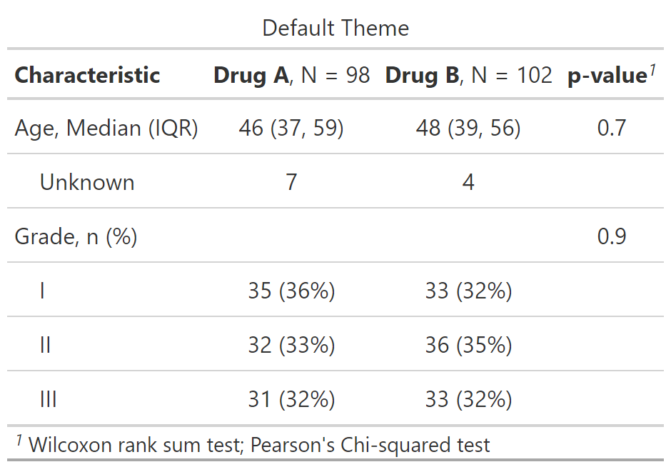
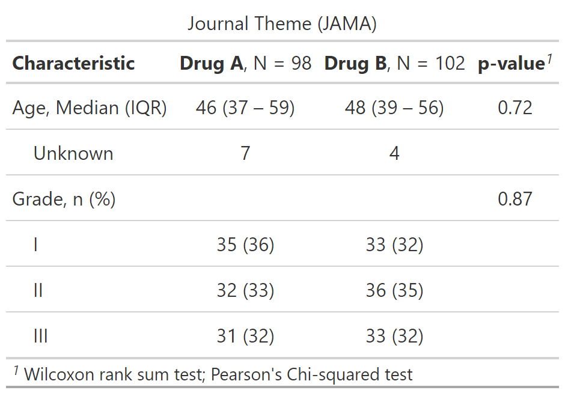
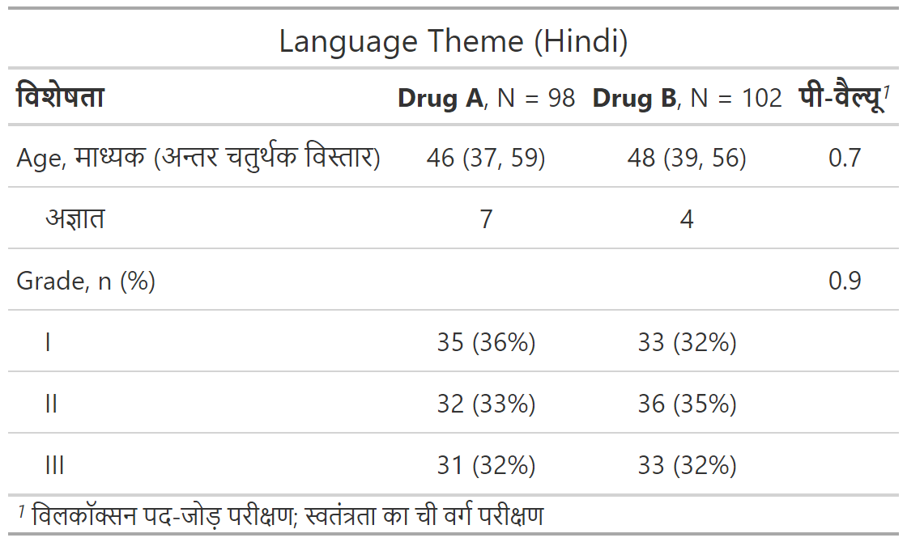
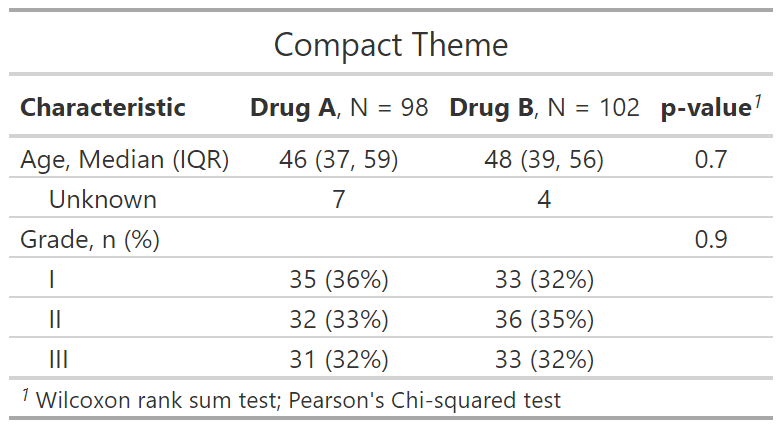

class: inverse, center, middle
# {gtsummary} themes

---
# {gtsummary} theme basics

.large[
- A **theme** is a set of customization preferences that can be easily set and reused. 

- Themes control **default settings for existing functions**

- Themes control more **fine-grained customization** not available via arguments or helper functions

- Easily use one of the **available themes**, or **create your own**
]


---
# {gtsummary} default theme

.pull-left[

```{r results=FALSE}
reset_gtsummary_theme()
trial |>
  select(age, grade, trt) |>
  tbl_summary(by = trt) |>
  add_stat_label() |>
  add_p() |>
  modify_caption("Default Theme")
```

```{r include = FALSE}
reset_gtsummary_theme()
no_theme <- 
trial %>%
  select(age, grade, trt) %>%
  tbl_summary(by = trt) %>%
  add_stat_label() %>%
  add_p() %>%
  modify_caption("Default Theme")
my_gtsave("no_theme")
```
]

.pull-right[
<p align="center"></p>
]


---
# {gtsummary} theme_gtsummary_journal()

.pull-left[

```{r results=FALSE, message = FALSE}
reset_gtsummary_theme()
theme_gtsummary_journal(journal = "jama")
trial |>
  select(age, grade, trt) |>
  tbl_summary(by = trt) |>
  add_stat_label() |>
  add_p() |>
  modify_caption("Journal Theme (JAMA)")
```

```{r include = FALSE}
reset_gtsummary_theme()
theme_gtsummary_journal(journal = "jama")
jama_theme <- 
  trial %>%
  select(age, grade, trt) %>%
  tbl_summary(by = trt) %>%
  add_stat_label() %>%
  add_p() %>%
  modify_caption("Journal Theme (JAMA)")
my_gtsave("jama_theme")
```

]

.pull-right[
<p align="center"></p>
]

.medium[
Journal options include `jama`, `lancet`, `nejm`, `qjecon`. 

**Contributions welcome!**
]


---
# {gtsummary} theme_gtsummary_language()

.pull-left[
```{r results=FALSE, message = FALSE}
reset_gtsummary_theme()
theme_gtsummary_language(language = "hi")
trial |>
  select(age, grade, trt) |>
  tbl_summary(by = trt) |>
  add_stat_label() |>
  add_p() |>
  modify_caption("Language Theme (Hindi)")
```

```{r include = FALSE}
reset_gtsummary_theme()
theme_gtsummary_language(language = "hi")
lang_theme <- 
  trial %>%
  select(age, grade, trt) %>%
  tbl_summary(by = trt) %>%
  add_stat_label() %>%
  add_p() %>%
  as_gt() %>%
  gt::tab_header("Language Theme (Hindi)")
my_gtsave("lang_theme")
```

]

.pull-right[
<p align="center"></p>
]

.medium[
Language options: "de" (German), "en" (English), "es" (Spanish), "fr" (French), "gu" (Gujarati), "hi" (Hindi), "is" (Icelandic), "ja" (Japanese), "kr" (Korean), "mr" (Marathi), "nl" (Dutch), "no" (Norwegian), "pt" (Portuguese), "se" (Swedish), "zh-cn" (Chinese - Simplified), "zh-tw" (Chinese - Traditional)
]


---
# {gtsummary} theme_gtsummary_compact()

.pull-left[
```{r results=FALSE, message = FALSE}
reset_gtsummary_theme()
theme_gtsummary_compact()
trial |>
  select(age, grade, trt) |>
  tbl_summary(by = trt) |>
  add_stat_label() |>
  add_p() |>
  modify_caption("Compact Theme")
```

```{r include = FALSE}
reset_gtsummary_theme()
theme_gtsummary_compact()
compact_theme <- 
  trial %>%
  select(age, grade, trt) %>%
  tbl_summary(by = trt) %>%
  add_stat_label() %>%
  add_p() %>%
  as_gt() %>%
  gt::tab_header("Compact Theme")
my_gtsave("compact_theme")
```
]

.pull-right[
<p align="center"></p>
]

.medium[
Reduces padding and font size
]


---
# {gtsummary} set_gtsummary_theme()

.large[
- `set_gtsummary_theme()` to create a custom theme
- See the {gtsummary} + themes vignette: http://www.danieldsjoberg.com/gtsummary/articles/themes.html
]


