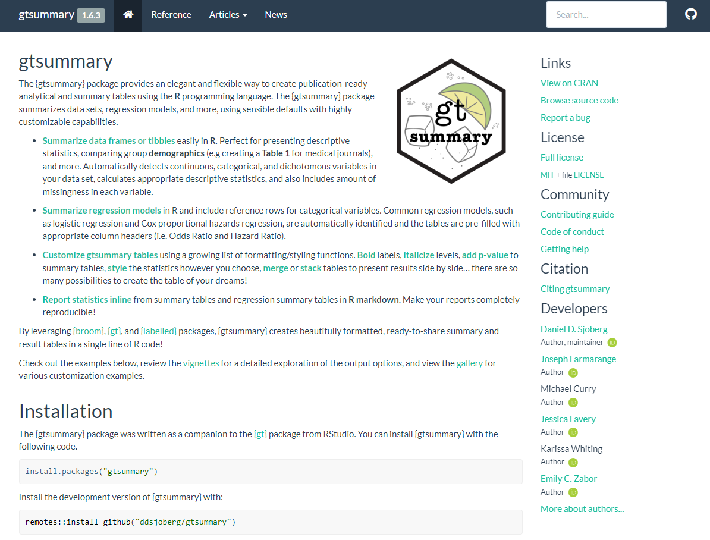

class: inverse, center, middle
# In Closing


---
# {gtsummary} website

.large[http://www.danieldsjoberg.com/gtsummary/]

<p align="center"></p>


---
# {gtsummary} installation

.pull-left[
Install the production version of {gtsummary} from CRAN:

```{r eval = FALSE}
install.packages("gtsummary")
```

Install the development version of {gtsummary} from GitHub:

```{r eval = FALSE}
remotes::install_github("ddsjoberg/gtsummary")
```
]


.pull-right[

```{r echo = FALSE, fig.width = 5, fig.height = 5, message = FALSE, warning = FALSE}
cranlogs::cran_downloads(packages = "gtsummary", 
                         from = "2019-05-05") |> 
  ggplot(aes(x = date, y = cumsum(count))) +
  geom_area(fill = ezfun::ccf_palette("main")[1], alpha = 0.8) +
  scale_y_continuous(
    expand = c(0, 0),
    labels = style_number,
    n.breaks = 6
  ) +
  # scale_x_continuous(
  #   expand = c(0, 0),
  #   labels = function(x) format(lubridate::as_date(x), format = "%b %Y"),
  #   n.breaks = 6
  # ) +
  labs(x = NULL, y = "Cumulative Downloads") +
  theme_xaringan() 
```

]


---
# Package authors/contributors

.large[
.pull-left[
**Daniel D. Sjoberg** (maintainer)

Michael Curry 

Joseph Larmarange 

Jessica Lavery 

Karissa Whiting 

Emily C. Zabor 

Xing Bai
]
.pull-right[
Esther Drill 

Jessica Flynn 

Margie Hannum 

Stephanie Lobaugh

Shannon Pileggi 

Amy Tin 

Gustavo Zapata Wainberg
]
]

---
# Thank you!

.large[

`r fontawesome::fa("link")`: [emilyzabor.com](https://www.emilyzabor.com/)

`r fontawesome::fa("envelope")`: [zabore2@ccf.org](mailto:zabore2@ccf.org)

`r fontawesome::fa("github")`: [zabore](https://github.com/zabore/)

`r fontawesome::fa("twitter")`: [zabormetrics](https://twitter.com/zabormetrics)

]