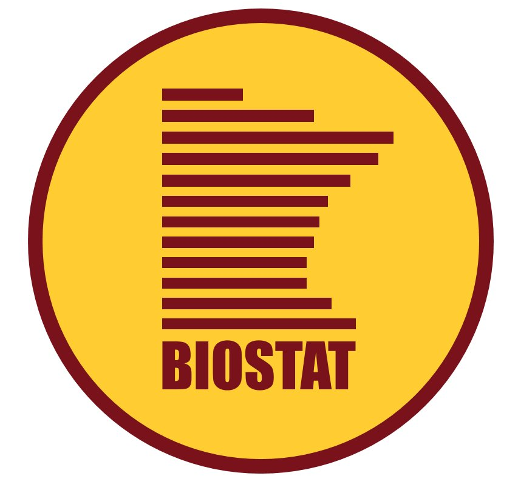

```{r setup, include=FALSE, warning=FALSE}
set.seed(78987)
library(xaringanthemer)

style_mono_accent(
  base_color = ezfun::ccf_palette("main")[1]
)

# xaringan::inf_mr() 
options(htmltools.dir.version = FALSE) 

# helper function to save gtsummary objects
my_gtsave <- function(x) {
  # if being knitted, then skip (save your objects before you knit)
  if (isTRUE(getOption('knitr.in.progress'))) return(invisible(NULL))
   
  path <- file.path("Images", paste0(x, ".png"))
  x <- eval(parse(text=x)) 
  if (inherits(x, "gtsummary")) x <- as_gt(x) 
  gt::gtsave(x, path)   
}    

knitr::opts_chunk$set(fig.dim=c(4.8, 4.5), fig.retina=2, out.width="100%")
```


class: inverse, center, title-slide, middle

# Creating publication-ready summary tables with {gtsummary}

### Emily C. Zabor

#### RUG at HDSI

#### December 15, 2022


<p align="center"></p>


---
# About me

.left-column[



]

.right-column[

.medium[
* MS in Biostatistics from the **University of Minnesota**

<br>
<br>

* 9 years as a Research Biostatistician at **Memorial Sloan Kettering Cancer Center**

<br>

* DrPH in Biostatistics from **Columbia University** 

<br>

* Faculty Biostatistician at **Cleveland Clinic**
]
]


---
```{r child='01-background.Rmd'}
```

---
```{r child='02-tbl_summary.Rmd'}
```

---
```{r child='03-tbl_regression.Rmd'}
```

---
```{r child='04-inline_text.Rmd'}
```

---
```{r child='05-tbl_merge.Rmd'}
```

---
```{r child='06-themes.Rmd'}
```

---
```{r child='07-print_engines.Rmd'}
```

---
```{r child='08-summary.Rmd'}
```

